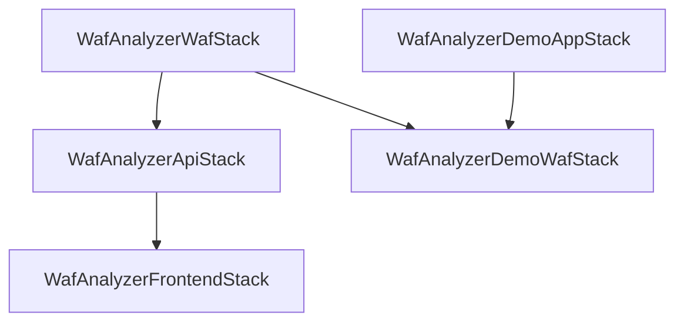

# AWS WAF Log Analyzer - Architecture Documentation

## 📋 Overview

AWS WAF Log Analyzerは、AWS WAFのログを分析し、AIを活用してセキュリティルールの最適化を支援するWebアプリケーションです。本文書では、システムの全体アーキテクチャ、コンポーネント設計、およびデータフローについて詳細に説明します。

## 🏗️ Architecture Diagrams

### Infrastructure as Code による図面管理

このプロジェクトでは、アーキテクチャ図を **Infrastructure as Code (IaC)** として管理しています。Python + Diagrams ライブラリを使用して、一貫性のある高品質な図面を自動生成します。

```bash
# アーキテクチャ図の生成
cd architecture && ./generate.sh

# または npm script経由
npm run architecture
```

### 生成される図面

1. **[システム全体図](./architecture/waf-analyzer-architecture.png)**
   - 全コンポーネントと依存関係
   - フロントエンド、バックエンド、デモアプリの関係性

2. **[データフロー図](./architecture/data-flow.png)**
   - リクエストからログ、分析、可視化までの流れ
   - WAF保護からAI分析までのパイプライン

3. **[セキュリティアーキテクチャ図](./architecture/security-architecture.png)**
   - 攻撃ベクトルと防御メカニズム
   - WAFルールセットと検出・対応フロー

4. **[デプロイメント図](./architecture/deployment-architecture.png)**
   - CDKスタック構成と依存関係
   - AWSサービスの配置とネットワーク構成

## 🎯 System Components

### Frontend Layer
- **Technology**: React + TypeScript + Material-UI
- **Hosting**: CloudFront + S3
- **Features**: 
  - WAFログ分析ダッシュボード
  - ルール管理インターフェース
  - AI分析結果の可視化

### API Layer
- **Technology**: API Gateway + Lambda (Node.js)
- **Functions**:
  - `log-analyzer`: WAFログの解析とパターン検出
  - `rule-manager`: WAFルールの管理とCRUD操作
  - `ai-assistant`: Amazon Bedrockとの統合・AI分析

### Demo Application
- **Purpose**: WAFの動作テストとログ生成
- **Features**:
  - 様々な攻撃パターンのシミュレーション
  - SQLインジェクション、XSS、レート制限テスト
  - ボット・スキャナー検出のテスト

### WAF Protection
- **Main WAF**: ログ収集用の基本WAF設定
- **Demo WAF**: 包括的なルールセットでデモアプリを保護
  - AWS Managed Rules (Common, SQLi, Known Bad Inputs)
  - カスタムレート制限ルール
  - 管理者パス保護ルール
  - 疑わしいUser-Agent検出ルール

### Logging Infrastructure
- **Collection**: Kinesis Firehose
- **Storage**: S3 (圧縮・暗号化)
- **Format**: JSON形式のWAFログ
- **Retention**: 90日（ライフサイクルポリシー）

### AI Analysis
- **Service**: Amazon Bedrock (Claude)
- **Capabilities**:
  - ログパターンの自動分析
  - 脅威レベルの評価
  - ルール設定の最適化提案
  - 誤検知の削減提案

### Data Storage
- **DynamoDB**: 分析結果とメタデータ
- **S3**: WAFログとアーカイブ
- **Encryption**: 保存時・転送時暗号化

## 🔄 Data Flow

### 1. Traffic Flow
```
Users/Attackers → Demo API Gateway → Demo WAF → Demo Lambda Functions
                                   ↓
                               WAF Logs Generated
```

### 2. Log Processing
```
WAF Logs → Kinesis Firehose → S3 Bucket → Log Analyzer Lambda
                                              ↓
                                        DynamoDB (Results)
```

### 3. Analysis Flow
```
Frontend Dashboard → Analysis API → Log Analyzer → S3 Logs
                                 → Rule Manager → WAF Configuration  
                                 → AI Assistant → Bedrock → Insights
```

### 4. Feedback Loop
```
AI Analysis Results → Rule Recommendations → WAF Rule Updates → Improved Protection
```

## 🛡️ Security Architecture

### Defense in Depth

1. **Perimeter Defense**
   - CloudFront with AWS WAF
   - DDoS protection
   - Geographic restrictions

2. **Application Layer**
   - API Gateway throttling
   - Lambda function isolation
   - IAM role-based access control

3. **Data Layer**
   - S3 bucket encryption
   - DynamoDB encryption at rest
   - VPC endpoints for private communication

4. **Monitoring & Logging**
   - CloudTrail for API calls
   - WAF logs for security events
   - Lambda function logs

### Attack Surface Analysis

| Attack Vector | Protection Mechanism | Detection Method |
|---------------|---------------------|------------------|
| SQL Injection | AWS Managed SQLi Rules | Pattern matching + AI analysis |
| XSS | Common Rules + Input validation | Content analysis |
| Rate Limiting | Rate-based rules | Frequency analysis |
| Bot Traffic | User-Agent analysis | Behavioral patterns |
| Admin Access | IP allowlist + authentication | Access pattern analysis |

## 📦 Deployment Architecture

### CDK Stack Organization

```
WafAnalyzerWafStack (Foundation)
├── S3 Bucket (Logs)
├── Kinesis Firehose
└── Basic WAF Configuration

WafAnalyzerApiStack (Core Application)
├── API Gateway
├── Lambda Functions (3)
├── DynamoDB Table
└── IAM Roles

WafAnalyzerFrontendStack (User Interface)
├── CloudFront Distribution
├── S3 Website Hosting
└── DNS Configuration

WafAnalyzerDemoAppStack (Testing)
├── Demo API Gateway
├── Demo Lambda Functions
└── Demo DynamoDB

WafAnalyzerDemoWafStack (Protection)
├── Comprehensive WAF Rules
├── Log Configuration
└── Association with Demo API
```

### Dependencies



## 🔧 Configuration Management

### Environment Variables
- `LOG_BUCKET_NAME`: S3 bucket for WAF logs
- `ANALYSIS_TABLE_NAME`: DynamoDB table for results
- `BEDROCK_MODEL_ID`: AI model identifier
- `API_BASE_URL`: Frontend API endpoint

### IAM Permissions
- **Principle of Least Privilege**: Each component has minimal required permissions
- **Service-to-Service**: Lambda functions use execution roles
- **Cross-Service**: S3, DynamoDB, Bedrock access via IAM policies

## 📊 Monitoring & Observability

### Metrics
- WAF request counts and block rates
- Lambda function duration and errors
- DynamoDB read/write capacity
- S3 storage and access patterns

### Logging
- CloudTrail for AWS API calls
- WAF logs for security events
- Lambda function logs for debugging
- Application-specific metrics

### Alerting
- High block rates (potential attacks)
- Lambda function errors
- DynamoDB throttling
- Unusual access patterns

## 🚀 Scalability Considerations

### Auto-scaling Components
- **Lambda Functions**: Automatic scaling based on demand
- **DynamoDB**: On-demand billing mode
- **API Gateway**: Built-in auto-scaling
- **S3**: Unlimited storage capacity

### Performance Optimization
- **CloudFront Caching**: Static content distribution
- **Lambda Cold Start**: Provisioned concurrency for critical functions
- **DynamoDB Indexes**: Optimized query patterns
- **S3 Transfer Acceleration**: Faster log uploads

## 🔄 Maintenance & Updates

### Architecture Diagram Updates
When making architectural changes:

1. Update `architecture/architecture.py`
2. Regenerate diagrams: `npm run architecture`
3. Commit updated diagrams with code changes
4. Update documentation as needed

### Infrastructure Updates
- Use CDK for all infrastructure changes
- Test in development environment first
- Use gradual deployment strategies
- Monitor metrics during updates

## 📚 Related Documentation

- [README.md](./README.md) - Project overview and setup
- [Claude.md](./Claude.md) - Development guidelines
- [architecture/README.md](./architecture/README.md) - Diagram generation details
- [scripts/README.md](./scripts/README.md) - Testing and utilities

---

> **Note**: This architecture is designed to be modular, scalable, and secure. Each component can be independently updated or replaced while maintaining system integrity.