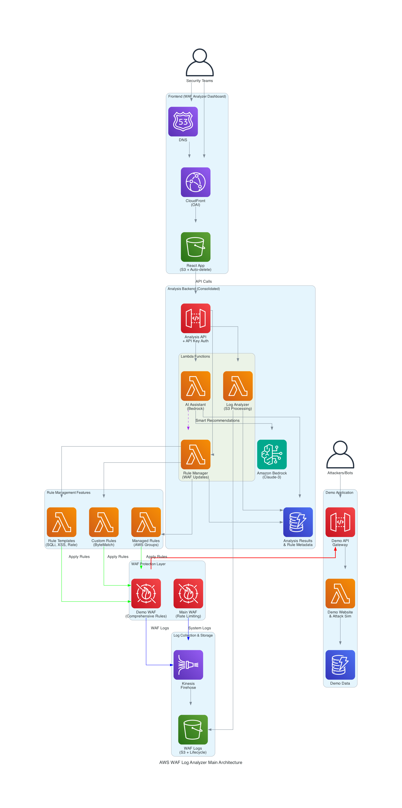
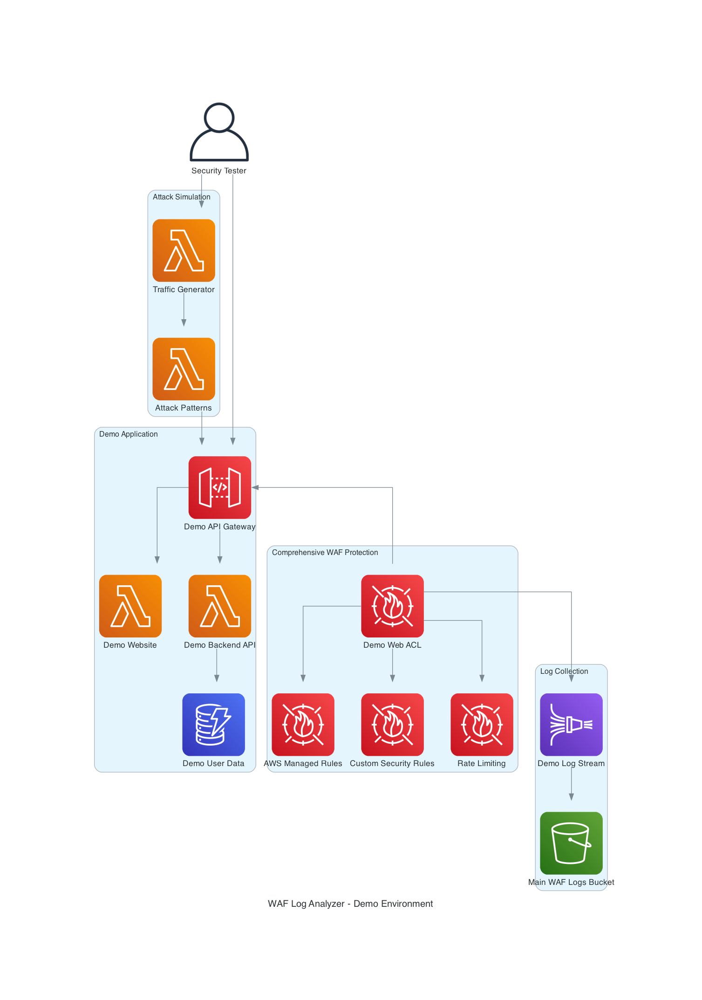

# AWS WAF Log Analyzer

AWS WAFのログを分析し、AIを活用してセキュリティルールの最適化を支援するWebアプリケーションです。

## 概要

このアプリケーションは、日々のセキュリティハンティングやWAFルール設定の調整を効率化するために設計されています。Amazon Bedrockを活用したAI機能により、ログパターンから最適なルール設定を提案し、セキュリティポスチャーの継続的な改善を支援します。

## 主な機能

- **ログ分析ダッシュボード**: WAFログのリアルタイム可視化と分析
- **ルール管理**: マネージドルールグループ、カスタムルール、レートベースルールの統合管理
- **AI支援**: Amazon Bedrockによるインテリジェントなルール推奨
- **脅威ハンティング**: 異常パターンの検出と対応提案

## クイックスタート

### 前提条件

- Node.js 18.x以上
- AWS CLI設定済み
- AWS CDK CLI (`npm install -g aws-cdk`)
- 有効なAWSアカウント

### 🚀 クイックデプロイ

```bash
# リポジトリのクローン
git clone <repository-url>
cd cdk_vibe_coding

# 自動デプロイスクリプトを実行
./deploy.sh

# または段階的デプロイ
./deploy.sh --all
```

### 📋 手動デプロイ

```bash
# 依存関係のインストール
npm install

# CDKブートストラップ（初回のみ）
cdk bootstrap

# 全スタックのデプロイ（統合版）
cdk deploy --all

# または個別にデプロイ
cdk deploy WafAnalyzerMainStack       # メイン分析アプリケーション
cdk deploy WafAnalyzerDemoStack       # デモ環境とテスト用WAF
```

### 🔧 デプロイ前チェック

```bash
# 環境の事前確認
./deploy.sh --check

# デプロイ後の確認
./deploy.sh --verify

# 各種URLの確認
./deploy.sh --outputs
```

### デモ環境のセットアップ

このプロジェクトには、WAFの動作をテストするためのデモアプリケーションが含まれています：

```bash
# デプロイ完了後、デモアプリケーションのURLを確認
aws cloudformation describe-stacks \
  --stack-name WafAnalyzerDemoStack \
  --query 'Stacks[0].Outputs[?OutputKey==`DemoApiUrl`].OutputValue' \
  --output text

# トラフィック生成スクリプトを実行
node scripts/generate-traffic.js <DEMO_API_URL> --rpm 120 --duration 10
```

### 開発環境

```bash
# 開発サーバーの起動
npm run dev

# テストの実行
npm test

# リント・フォーマット
npm run lint
npm run format

# アーキテクチャ図生成
npm run architecture    # アーキテクチャ図を生成
npm run docs:update     # 図生成 + フォーマット

# CDKコマンド
npm run build      # TypeScriptをJSにコンパイル
npm run watch      # 変更を監視してコンパイル
npx cdk deploy     # スタックをデプロイ
npx cdk diff       # デプロイ済みスタックとの差分確認
npx cdk synth      # CloudFormationテンプレートを生成
```

### アーキテクチャ図の生成

このプロジェクトのアーキテクチャ図は Infrastructure as Code で管理されています：

```bash
# アーキテクチャ図を生成
npm run architecture

# または直接実行
cd architecture && ./generate.sh
```

生成される図：
- **システム全体図**: 全コンポーネントの関係性
- **データフロー図**: データの流れと処理フロー  
- **セキュリティ図**: 攻撃ベクトルと防御機構
- **デプロイメント図**: CDKスタック構成

## アーキテクチャ

### 統合された構成

プロジェクトは2つの主要スタックに統合されています：

1. **WafAnalyzerMainStack**: メインのWAF分析アプリケーション
2. **WafAnalyzerDemoStack**: デモ環境とテスト用WAF

### メインアプリケーション アーキテクチャ図



**主要コンポーネント:**
- **Frontend**: CloudFront + S3でホストされるReact Webダッシュボード
- **API Layer**: API Gateway + 3つのLambda関数（ログ分析、ルール管理、AI支援）
- **WAF & Logging**: AWS WAF + Kinesis Firehose + S3によるログ収集基盤
- **AI Analysis**: Amazon Bedrock (Claude)による知能化された分析
- **Data Storage**: DynamoDBによる分析結果保存

### デモ環境 アーキテクチャ



**テスト機能:**
- **Demo Application**: 攻撃パターンをシミュレートできるWebアプリケーション
- **Comprehensive WAF**: マネージドルール + カスタムルール + レート制限
- **Attack Simulation**: 様々な攻撃パターン（SQLi、XSS、ボット等）のテスト
- **Log Integration**: メインアプリケーションと共有されるログ収集基盤

> **注**: アーキテクチャ図は AWS Diagram MCPサーバーで生成されています。

### 主要コンポーネント

| コンポーネント | 役割 | 技術スタック |
|---------------|------|-------------|
| **フロントエンド** | WAF分析ダッシュボード | React + TypeScript + MUI |
| **分析API** | ログ処理・ルール管理・AI分析 | API Gateway + Lambda + Node.js |
| **デモアプリ** | WAFテスト用Webアプリケーション | API Gateway + Lambda |
| **WAF保護** | リクエストフィルタリング・ログ生成 | AWS WAF + マネージドルール |
| **ログ基盤** | ログ収集・保存・配信 | Kinesis Firehose + S3 |
| **AI分析** | パターン分析・ルール推奨 | Amazon Bedrock (Claude) |
| **データ保存** | 分析結果・設定データ | DynamoDB |

### セキュリティレイヤー

1. **入口制御**: CloudFront + WAF による攻撃フィルタリング
2. **認証・認可**: API Gateway + IAM による細かなアクセス制御
3. **データ保護**: S3暗号化 + DynamoDB暗号化
4. **監査**: CloudTrail + WAFログによる完全な監査証跡

## ディレクトリ構成

```
.
├── bin/                    # CDKアプリケーションのエントリポイント
├── lib/stacks/            # CDKスタック定義（統合版）
│   ├── main-app-stack.ts  # メインアプリケーション
│   └── demo-stack.ts      # デモ環境
├── src/                    # アプリケーションソースコード
│   ├── frontend/          # Reactフロントエンド
│   ├── backend/           # 分析Lambda関数
│   └── demo-backend/      # デモ用Lambda関数
├── generated-diagrams/    # 生成されたアーキテクチャ図
├── test/                   # テストコード
└── scripts/               # ユーティリティスクリプト
```

## 貢献方法

1. Featureブランチを作成 (`git checkout -b feature/amazing-feature`)
2. 変更をコミット (`git commit -m 'Add amazing feature'`)
3. ブランチをプッシュ (`git push origin feature/amazing-feature`)
4. Pull Requestを作成

## ライセンス

このプロジェクトはMITライセンスの下で公開されています。詳細は[LICENSE](LICENSE)ファイルを参照してください。

## サポート

問題や質問がある場合は、[Issues](https://github.com/your-repo/issues)でお知らせください。
